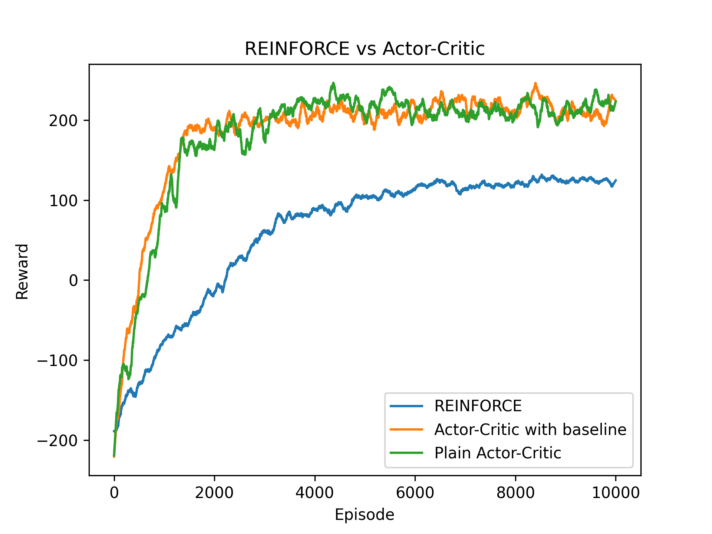
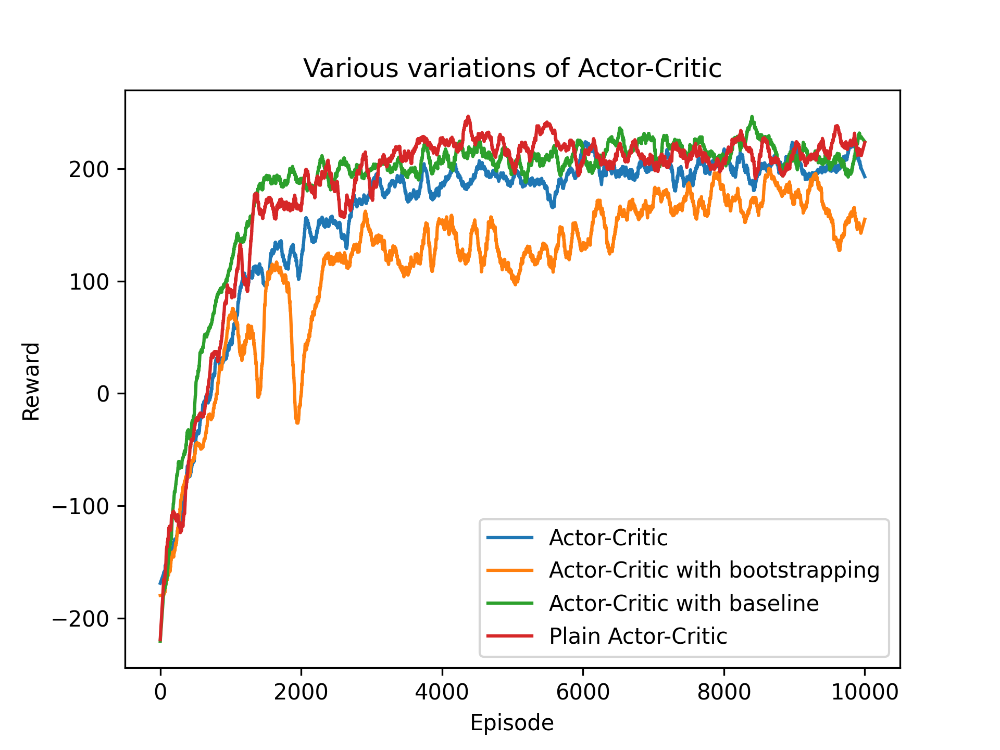
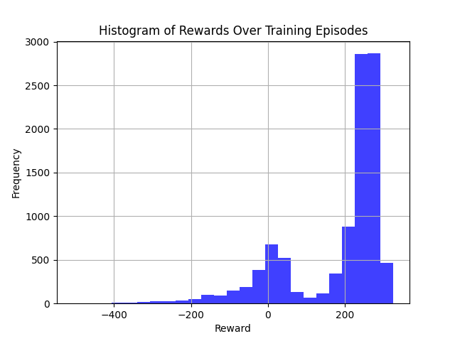

# Off-policy Reinforcement Learning

This repository contains coursework code for the Reinforcement Learning subject. 
The repository code solves two gym's environments (CartPole and LunarLander) using 
various off-policy reinforcement learning algorithms.

## Table of Contents

- [Overview](#overview)
- [CartPole Environment](#cartpole-environment)
  - [DQN Implementation](#dqn-implementation)
- [Lunar Lander Environment](#lunar-lander-environment)
  - [REINFORCE Algorithm](#reinforce-algorithm)
  - [Actor-Critic Algorithm](#actor-critic-algorithm)
  - [Experiments and Results](#experiments-and-results)
- [Findings](#findings)
- [Figures](#figures)
- [References](#references)

## Overview

This repository contains implementations of reinforcement learning algorithms to 
solve two environments provided by OpenAI Gym:

1. **CartPole**: Solved using Deep Q-Network (DQN).
2. **Lunar Lander**: Solved using two others off-policy algorithms - REINFORCE and Actor-Critic.

Each of the agent's interface was designed and created following the scikit-learn's interfaces.
Namely, each agent has their `fit`, `train`, and `test` methods designed to interact with environment. 
Rest of the code is an internal implementation to support above 3 functions.

## CartPole Environment

### DQN Implementation

The CartPole environment is a classic control problem where the goal is to balance a pole on a moving cart. The DQN algorithm is used to solve this environment. The implementation includes:

- **Network Architecture**: A simple feedforward neural network.
- **Experience Replay**: To stabilize training.
- **Target Network**: To prevent oscillations in Q-values.

You can find the code for the CartPole environment [here](cartpole-dqn/DQN.py).

## Lunar Lander Environment

The Lunar Lander environment is more complex, involving continuous control where the goal is to land a spacecraft on a landing pad.

### REINFORCE Algorithm

The REINFORCE algorithm is a policy gradient method that directly optimizes the policy 
by adjusting weights in the direction of increasing rewards.

The code for the REINFORCE agent can be found [here](lunarlander-onpolicy-a2c-reinforce/agents/reinforce_agent.py).

### Actor-Critic Algorithm

The Actor-Critic algorithm combines the benefits of both value-based and policy-based methods. It uses two networks:

- **Actor**: Learns the policy function.
- **Critic**: Learns the value function to reduce variance.

The code for the A2C agent can be found [here](lunarlander-onpolicy-a2c-reinforce/agents/actor_critic_agent.py).

### Experiments and Results

Extensive experiments were conducted to compare the performance of different implementations:

- **REINFORCE** vs. **Actor-Critic**.
- **Vanilla Actor-Critic** vs. **Advanced Actor-Critic** variants.

## Findings

Some key findings from the experiments include:

- DQN successfully solved the CartPole environment with high accuracy and stability.
- The REINFORCE algorithm required extensive tuning but provided a good baseline for the Lunar Lander environment.
- Actor-Critic algorithms showed significant improvements in training efficiency and stability over REINFORCE, particularly in handling the complex dynamics of the Lunar Lander environment.

## Figures

All figures from solving LunarLander environment can be found in 
`lunarlander-onpolicy-figures` directory. Below are some key figures from the experiments:

### REINFORCE vs Actor-Critic on Lunar Lander

### Actor-Critic Variants on Lunar Lander

### Histogram of rewards from A2C with baseline

## References

- [OpenAI Gym](https://gym.openai.com/)

